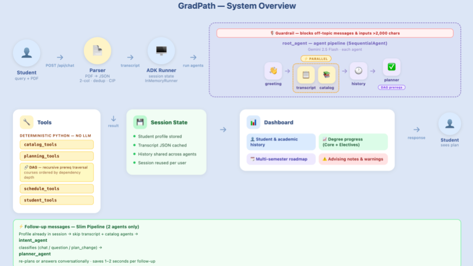

# GradPath — Academic Advising AI Agent

> An AI advisor that knows LU's catalog, knows your transcript, and never has a waitlist.

**Course:** CISC-867 · Spring 2026 · Lincoln University  
**Team:** Arun Vittedi · Srikanth Perumalla  
**Mentor:** Mina Samizadeh  
**Version:** v1.0.0 · License: Apache 2.0

---

## The Problem

Academic advising at Lincoln University faces four core challenges:

- **Advisors are overbooked** — students wait days for a 15-minute appointment
- **Manual cross-referencing** — students navigate catalog PDFs, schedule PDFs, and prerequisite chains by hand
- **High cost of mistakes** — one wrong course choice means a wasted semester
- **No intelligent tool exists** — nothing uses a student's actual transcript and LU's real data to say exactly what to take next

The cost of getting it wrong: delayed graduation, unnecessary tuition, lost time.

---

## What We Built

GradPath is a full-stack AI advising system that takes a student's transcript PDF and produces a personalized graduation roadmap in under 30 seconds.

| Feature | Description |
|---------|-------------|
| Transcript Upload | Upload a PDF — full graduation roadmap in seconds |
| Real LU Data | 597 courses · 29 majors · 468 schedule sections from official LU data |
| Smart Planning | Next-semester recommendations + semester-by-semester plan to graduation |
| Live Dashboard | Completed / In Progress / Remaining with credit breakdown |
| What-If Scenarios | "What if I switch to Biology?" · "What if I can only take 9 credits?" |
| Chat Interface | Feels like talking to a real advisor — natural follow-up messages |

---

## System Architecture



GradPath is built in five clearly separated layers:

| Layer | Technology | Responsibility |
|-------|-----------|----------------|
| Frontend | React + TypeScript | Two-panel layout (chat + dashboard) · print/PDF export |
| Backend | FastAPI | Session store · transcript upload · ADK pipeline router |
| ADK Pipelines | Google ADK + Gemini 2.5 Flash | Full pipeline (first message) + slim pipeline (follow-ups) |
| Tools | Pure Python | Catalog reader · schedule reader · prerequisite checker · planner |
| Data | JSON files | LU catalog · majors · schedules · student registry |

**Key design decision:** Python enforces all hard rules (prerequisite checks, schedule verification, credit limits) before Gemini sees any course list. Every recommendation traces back to an exact rule — not a guess by the AI.

---

## Repository Structure

```
gradpath-ai-advisor/
├── agent.py                  # ADK entry point
├── requirements.txt          # Pinned Python dependencies
├── .env.example              # Environment variable template
├── src/
│   ├── backend/
│   │   ├── app/              # FastAPI routes, models, config
│   │   ├── agents/           # LLM agents (greeting, transcript, catalog, planner, history)
│   │   └── tools/            # Pure Python tools (catalog, schedule, planning, student)
│   └── frontend/             # React + TypeScript UI
├── data/
│   ├── catalogs/             # LU course catalog (JSON + PDF)
│   ├── schedules/            # Semester schedule data (JSON + PDF)
│   ├── transcripts/          # Sample student transcripts
│   └── registry/             # Student index
├── scripts/                  # Data ingestion and setup scripts
├── tests/                    # 66 tests across 6 modules
├── figures/                  # Architecture diagrams
├── docs/                     # Additional documentation
└── results/                  # Evaluation outputs
```

---

## Getting Started

### Prerequisites
- Python 3.11+
- Node.js 18+
- A Google API key with Gemini access

### Installation

**1. Clone the repository**
```bash
git clone https://github.com/NSF-DARSE/gradpath-ai-advisor.git
cd gradpath-ai-advisor
```

**2. Set up Python environment**
```bash
python3 -m venv .venv
source .venv/bin/activate
pip install -r requirements.txt
```

**3. Add your API key**
```bash
cp .env.example .env
# Open .env and add your GOOGLE_API_KEY
```

**4. Build frontend and run**
```bash
cd src/frontend && npm install && npm run build && cd ../..
python scripts/run_gradpath_ui.py
```

Opens at **http://127.0.0.1:8000**  
Startup under 5 seconds · First response under 5 seconds

### Usage

1. Open the app in your browser
2. Upload your transcript PDF
3. GradPath asks for your target semester and goals
4. Get your next-semester picks + full graduation roadmap

Follow-up questions work too — ask "Why was CSC-3090 not recommended?" or "What if I take 15 credits?" and the plan updates instantly with no re-upload needed.

---

## Testing

```bash
pytest tests/
```

66 tests passing across 4 categories:

| Category | File | Count | What it tests |
|----------|------|-------|---------------|
| Unit | test_guardrails.py, test_transcript_parser.py, test_transcript_tools.py | 30 | One function at a time. No network. No AI. |
| Integration | test_integration.py | 17 | Real components + real data files |
| End-to-End | test_e2e.py | 14 | Full pipeline: transcript → parse → profile → recommendations |
| Performance | test_performance.py | 5 | Parse <500ms · 50 parses <5s · recommend_courses() <1s |

Tested on macOS (local) and Ubuntu (GitHub Actions CI).

---

## Performance

| Metric | Result |
|--------|--------|
| Single transcript parse | <500ms |
| 50 consecutive parses | <5s |
| recommend_courses() call | <1s |
| First full response | 2–4s |

Bottleneck is Gemini API latency — not Python, not disk I/O.

---

## Known Limitations

- Session memory is in-memory only — cleared on server restart
- Scanned / image-only PDFs require OCR preprocessing before upload
- Unlisted majors silently fall back to a CS plan

## Future Work

- Persistent session storage (SQLite or Redis)
- OCR support for scanned transcripts
- Student-facing GPA projections and credit tracking
- Student login system

---

## Contributing

All changes must go through pull requests. See the [NSF DARSE Git workflow guide](https://github.com/NSF-DARSE/RSE-course/blob/main/course_material/git_workflow/readme.md) for branch naming conventions and PR guidelines.

---

## License

Apache 2.0 — free to use, modify, and distribute with attribution.  
Student transcript data and LU catalog materials are explicitly excluded from this license.

© 2026 Arun Vittedi · Srikanth Perumalla · Lincoln University